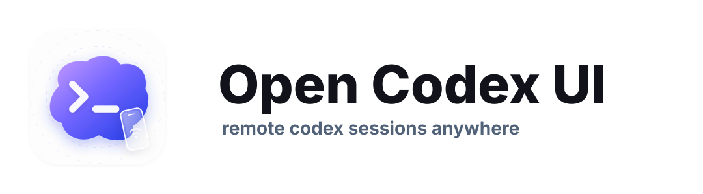

<p align="center">
  
</p>

# open-codex-ui

Remote-friendly Codex web workspace for continuing sessions from desktop and mobile browsers.

## Resume
[一二Resume](https://baike.baidu.com/item/%E4%B8%80%E4%BA%8C/23434669)

## Requirements

- [`uv`](https://docs.astral.sh/uv/) for running the published application
- Python 3.12+, Node.js 20+, and `pnpm` only for source development

## Install

Run the published application without a permanent installation:

```bash
uvx open-codex-ui
```

The wheel includes the compiled frontend and starts in production mode. For a
persistent command, install it as a uv tool:

```bash
uv tool install open-codex-ui
open-codex-ui
```

For source development, install the backend dependencies:

```bash
uv sync
```

Codex workspace support uses the published `open-codex-bridge` package from PyPI.

Then install the frontend dependencies:

```bash
cd web
pnpm install
```

## Authentication

This app now supports password protection for deployed environments.

Enable auth with either:

- `YIER_AUTH_PASSWORD`
- `YIER_AUTH_PASSWORD_HASH`

Plain password example:

```bash
export YIER_AUTH_PASSWORD='change-this-password'
```

Hashed password example:

```bash
uv run python -c "from yier_web.auth import hash_password; print(hash_password('change-this-password'))"
export YIER_AUTH_PASSWORD_HASH='paste-generated-hash-here'
```

Optional auth settings:

- `YIER_AUTH_SECRET`: optional extra signing secret for session cookies
- `YIER_AUTH_SESSION_TTL_HOURS`: cookie lifetime in hours, default is `168`
- `YIER_CODEX_EMBED_TOKEN`: token for unauthenticated Codex iframe access

If neither password variable is set, authentication is disabled.

## Codex Iframe Embed

See [IFRAME.md](./IFRAME.md) for iframe setup, authentication, and the
`postMessage` API.

## Development Startup

Development mode is different from production:

- The backend should run with `--debug`
- The frontend should run with Vite dev server
- In this mode, the backend proxies frontend requests to `http://127.0.0.1:5173`

Recommended one-command startup:

```bash
uv run open-codex-ui-dev
```

This starts:

- frontend: `pnpm dev`
- backend: debug mode with reload

If you prefer split terminals:

Frontend only:

```bash
uv run open-codex-ui-dev-web
```

Backend only:

```bash
uv run open-codex-ui-dev-backend
```

You can also override backend bind settings:

```bash
uv run open-codex-ui-dev --host 127.0.0.1 --port 9999
uv run open-codex-ui-dev-backend --host 127.0.0.1 --port 9999
```

Default address:

- App: `http://127.0.0.1:9999`
- Vite dev server: `http://127.0.0.1:5173`

Notes:

- Keep `pnpm dev` running, otherwise the backend cannot proxy the frontend in debug mode.
- API requests still go through the Python server at port `9999`.

## Production Startup

The published wheel includes the compiled frontend and does not use the Vite
dev server:

```bash
uvx open-codex-ui
```

The server listens on `127.0.0.1:9999` by default. Bind to the local network
explicitly when needed:

```bash
uvx open-codex-ui --host 0.0.0.0 --port 9999
```

When running from a source checkout, build the frontend before starting:

```bash
uv run open-codex-ui-build-web
uv run open-codex-ui-prod
```

In production mode:

- The backend serves the compiled assets packaged under `yier_web/static`
- No Vite proxy is used
- Authentication should usually be enabled with `YIER_AUTH_PASSWORD` or `YIER_AUTH_PASSWORD_HASH`

Production example:

```bash
export YIER_AUTH_PASSWORD='change-this-password'
uvx open-codex-ui --host 0.0.0.0 --port 9999
```

## Common Commands

Backend tests:

```bash
uv run --all-packages pytest
```

Targeted backend tests:

```bash
uv run --all-packages pytest tests/test_codex_backend.py tests/test_codex_workspace.py tests/test_app.py
```

Backend compile check:

```bash
uv run python -m compileall yier_web
```

Frontend unit tests:

```bash
cd web
pnpm test:unit
```

Frontend type check:

```bash
cd web
pnpm type-check
```

Frontend production build:

```bash
uv run open-codex-ui-build-web
```

## Startup Summary

Development:

```bash
uv run open-codex-ui-dev
```

Production:

```bash
export YIER_AUTH_PASSWORD='change-this-password'
uvx open-codex-ui --host 0.0.0.0 --port 9999
```

## Available uv Scripts

Development:

- `uv run open-codex-ui-dev`: start frontend and backend together
- `uv run open-codex-ui-dev-web`: start Vite only
- `uv run open-codex-ui-dev-backend`: start backend only in debug mode

Production:

- `uvx open-codex-ui`: run the published wheel in production mode
- `uv run open-codex-ui-build-web`: build frontend assets
- `uv run open-codex-ui-prod`: start backend in production mode
